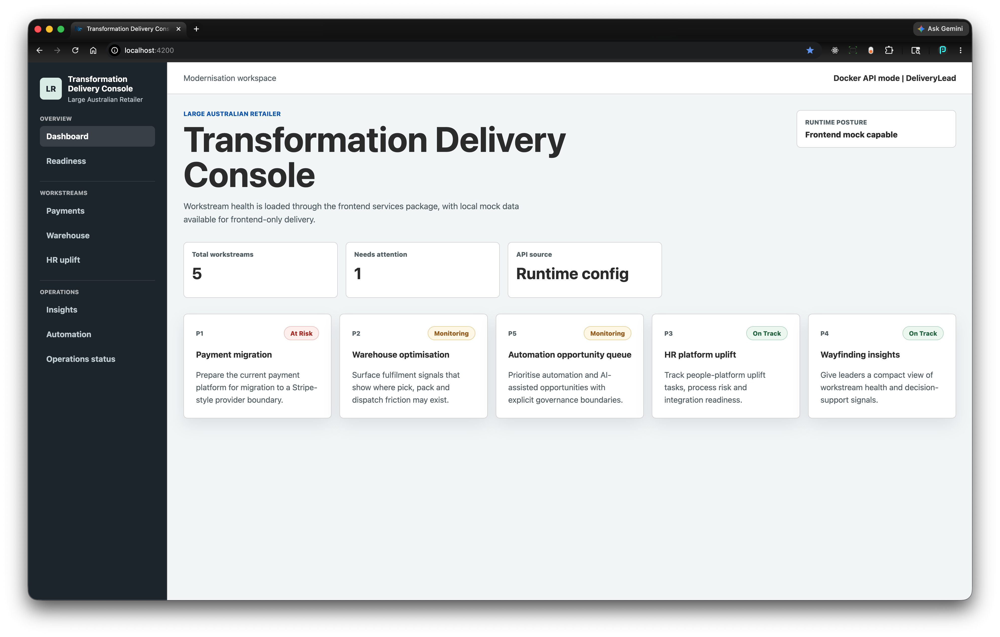
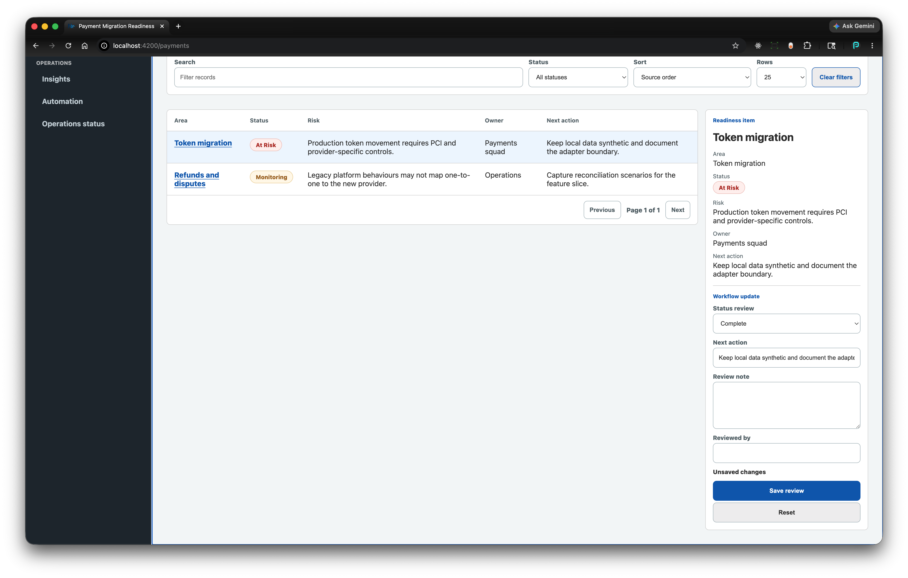

# Large Australian Retailer Modernisation Prototype

Working prototype for an interview: an Angular transformation console backed by a .NET API.

The client framing is intentionally neutral. The prototype demonstrates delivery judgement for a large Australian retailer modernisation program without naming or copying a real client.

## Screenshots

| Dashboard and runtime posture                                                            | Payments workflow review                                                         |
| ---------------------------------------------------------------------------------------- | -------------------------------------------------------------------------------- |
|  |  |

## Repository Shape

```text
lar-modernisation-prototype/
  frontend/   Nx Angular workspace
  backend/    .NET solution and layered projects
  docs/       handover notes for reviewers
```

## Current Scope

- Angular/Nx workspace under `frontend`.
- .NET solution under `backend`.
- Angular app shell, routed dashboard and frontend libraries.
- EF Core SQLite persistence with deterministic seed data.
- API endpoints for workstreams and five feature slices.
- Program readiness endpoint and route for derived delivery posture.
- Operations status endpoint and route for runtime readiness and seeded data counts.
- Docker Compose runtime with frontend and backend containers.
- GitHub Actions CI workflow for frontend, backend and Docker image gates.
- One git repository at this folder root for both frontend and backend.

## Run Locally

Frontend:

```bash
cd frontend
pnpm dev
```

Backend:

```bash
dotnet run --project backend/src/LargeRetailer.Modernisation.Api
```

Full stack with Docker:

```bash
docker compose up --build
```

Open:

- Frontend: http://localhost:4200
- Backend health: http://localhost:5029/health

## Verify

Standard gate:

```bash
pnpm verify
```

Frontend production build:

```bash
cd frontend
pnpm exec nx build transformation-console
```

Full gate including Docker image build:

```bash
pnpm verify:full
```

Frontend-only checks:

```bash
pnpm frontend:format:check
pnpm frontend:lint
pnpm frontend:typecheck
pnpm --dir frontend exec playwright install
pnpm frontend:e2e
```

Backend-only checks:

```bash
pnpm backend:format:check
pnpm backend:build
pnpm backend:test
```

Docker:

```bash
docker compose build
docker compose up
```

## Runtime Configuration

The browser reads `frontend/apps/transformation-console/public/assets/runtime-config.js`. The checked-in copy is a default mock-mode fallback for first-run local review, but it is still generated browser config. Do not treat it as the source of truth.

For local frontend runs, set values in the repository root `.env.local`, then run `pnpm config:local` from `frontend` or use `pnpm dev`, which runs the generator before serving.

For GitHub Actions, the frontend job sets the same `LAR_FRONTEND_*` values as environment variables and runs `pnpm config:local` before build and smoke tests. CI keeps smoke tests in mock mode so they do not depend on a running backend.

The frontend container writes `/assets/runtime-config.js` at startup. Override these values when needed:

```bash
LAR_FRONTEND_API_BASE_URL=http://localhost:5029
LAR_FRONTEND_ENVIRONMENT_LABEL="Docker API mode"
LAR_FRONTEND_MOCK_API=false
LAR_FRONTEND_ROLE=DeliveryLead
LAR_BACKEND_CORS_ORIGIN=http://localhost:4200
LAR_BACKEND_RATE_LIMIT_PERMIT_LIMIT=120
LAR_BACKEND_RATE_LIMIT_WINDOW_SECONDS=60
```

See [docs/reviewer-runbook.md](docs/reviewer-runbook.md) for the reviewer smoke checklist and handover notes.
See [docs/architecture.md](docs/architecture.md) for the application shape and runtime flow.
See [docs/decisions.md](docs/decisions.md) for the key technical decisions behind the prototype.
See [docs/ci-deployment-notes.md](docs/ci-deployment-notes.md) for CI and deployment packaging notes.
See [docs/azure-deployment-blueprint.md](docs/azure-deployment-blueprint.md) for the Azure promotion blueprint.

## What Is Real

- Runnable Angular app.
- Frontend library boundaries for services, UI assets, UI library, UI tokens and utils.
- Dashboard workstream data loaded from the .NET API through `libs/services`.
- Feature routes for payments, warehouse, HR uplift, insights and automation.
- Readiness route for derived program score, signals and recommended next actions.
- Operations route for API readiness, SQLite status and seeded dataset counts.
- Persisted workflow review writes protected by a demo role boundary.
- Server-side feature query contracts with paging, filtering and sort validation.
- Baseline security hardening: API rate limiting, explicit CORS config and nginx security headers.
- Automation governance review events for candidate triage.
- Shared formatting and standards gates for frontend and backend.
- Docker Compose stack for local full-stack review.
- GitHub Actions workflow that validates frontend, backend and Docker packaging.
- Runnable .NET API with layered project structure.
- EF Core SQLite database created locally at API startup.
- Seeded workstream and initiative data served through application services.
- Backend unit and integration tests.

## API Surface

```text
GET /health
GET /health/live
GET /health/ready
GET /api/operations/status
GET /api/program/readiness
GET /api/workstreams
GET /api/workstreams/{id}
GET /api/payments/migration-readiness
GET /api/warehouse/optimisation
GET /api/hr/platform-uplift
GET /api/insights/wayfinding
GET /api/automation/candidates
GET /api/automation/candidates/{candidateId}/governance-review
POST /api/automation/candidates/{candidateId}/governance-review
GET /api/workflow-reviews/{slice}/{recordId}
POST /api/workflow-reviews/{slice}/{recordId}
```

## What Is Simulated

- Payment provider integration.
- Warehouse, HRIS and analytics feeds.
- AI/model calls.
- Model-provider governance, prompt registry and evaluation harness.
- Enterprise SSO, PCI controls, row-level security and cloud deployment.

Workflow review writes use a demo role header, not real identity:

```text
X-LAR-DEMO-ROLE: DeliveryLead
```

Those boundaries should be named honestly in case of production expansion.
