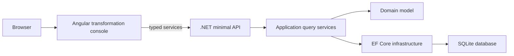

# Architecture

This prototype is a single repository with two independently runnable application areas:

- `frontend`: Nx Angular workspace for the transformation console.
- `backend`: layered .NET solution for API, application, domain, infrastructure and tests.

The repository root owns shared developer workflow, Docker Compose and CI orchestration. The frontend and backend keep their own native toolchains, dependency manifests and build outputs.

## Runtime Flow

Angular reads runtime API configuration from `/assets/runtime-config.js`, which allows the same production build to target either local development or Docker-hosted API URLs. Local development writes the file with `frontend/scripts/write-runtime-config.mjs`; the nginx Docker image rewrites it at container startup from `LAR_FRONTEND_API_BASE_URL`, `LAR_FRONTEND_MOCK_API` and `LAR_FRONTEND_ENVIRONMENT_LABEL`.

The .NET API creates and seeds the SQLite database on startup. That keeps the prototype self-contained while still exercising realistic persistence, query services and integration tests.

## Azure Promotion View

The local Docker shape maps cleanly to Azure without changing the application boundaries:

- frontend static assets can move to Azure Static Web Apps, App Service or Front Door/CDN;
- the .NET API container can move to Azure Container Apps or App Service for Containers;
- SQLite would be replaced by Azure SQL for production relational storage;
- Key Vault, Application Insights and GitHub Actions environments would provide secrets, telemetry and promotion gates.

See [azure-deployment-blueprint.md](azure-deployment-blueprint.md) for the detailed Azure-oriented deployment sketch. It is a blueprint only; this repository does not provision Azure resources.

## Frontend Shape

- `apps/transformation-console`: routed Angular application.
- `apps/transformation-console-e2e`: Playwright smoke tests.
- `libs/services`: typed API client and DTO contracts.
- `libs/ui-library`: shared shell and UI components.
- `libs/ui-assets`: neutral naming and brand metadata.
- `libs/ui-tokens`: design tokens.
- `libs/utils`: small pure helpers.

This follows the Angular/Nx convention of `apps` plus `libs`, instead of a Next.js-style `packages` folder.

## Backend Shape

- `LargeRetailer.Modernisation.Api`: HTTP endpoints, health checks and dependency registration.
- `LargeRetailer.Modernisation.Application`: query services and DTOs.
- `LargeRetailer.Modernisation.Domain`: entities and domain-facing types.
- `LargeRetailer.Modernisation.Infrastructure`: EF Core SQLite persistence and seed data.
- `tests`: API, application and integration test projects.

The API exposes health, operations status, program readiness, workstreams and five feature slices. Feature data is intentionally seeded but flows through the same boundaries a production implementation would extend.

Automation governance reviews are append-only events tied to automation candidates. They capture triage status, data sensitivity, model risk, expected benefit, evidence/source and reviewer details before any model-provider integration is introduced.

## Verification

The standard gate is `pnpm verify`. The full packaging gate is `pnpm verify:full`, which adds Docker image builds after frontend and backend checks.
