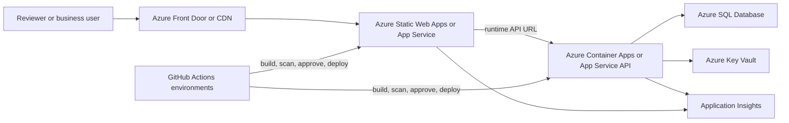

# Azure Deployment Blueprint

This is a promotion blueprint, not a deployed environment. It shows how the current Angular + .NET prototype could move from local Docker review into Azure without changing the core application boundaries.

## Target Shape

## Service Mapping

| Current prototype piece | Azure candidate | Why |
| --- | --- | --- |
| Angular production build served by nginx | Azure Static Web Apps, App Service, or Front Door/CDN over static assets | Preserves the static frontend/runtime-config split while adding managed HTTPS, CDN and environment routing. |
| .NET minimal API container | Azure Container Apps or App Service for Containers | Fits the existing Dockerfile and keeps API hosting separate from frontend delivery. |
| SQLite local volume | Azure SQL Database | Production relational storage with backups, scaling, auditing and managed operations. |
| Runtime config and secrets | Azure Key Vault plus app settings | Moves connection strings, API origins and future identity secrets out of files and images. |
| Correlation IDs and logs | Application Insights with OpenTelemetry | Extends B3 correlation into searchable traces, logs, metrics and dashboards. |
| GitHub Actions checks | GitHub Actions environments and approvals | Adds promotion gates after the existing frontend, backend and Docker jobs. |

## Recommended Environments

- `dev`: automatic deploys from main after CI passes.
- `test`: manual approval, seeded non-production data, smoke tests and accessibility checks.
- `prod`: manual approval, protected secrets, stricter CORS/CSP, backup policy and incident runbook.

## Configuration Model

The current runtime config pattern still applies:

- frontend receives `LAR_FRONTEND_API_BASE_URL` during startup or release packaging;
- API receives `Cors:AllowedOrigins`, rate-limit values and database connection settings from environment-specific app settings;
- secrets move to Key Vault references rather than plain environment variables;
- CSP `connect-src` should be tightened to the final API hostname once known.

## Data Path

SQLite remains the local reviewer default. A production Azure path would replace it with Azure SQL and add:

- EF Core SQL Server provider registration;
- migrations or migration bundle execution in deployment;
- backup and point-in-time restore policy;
- database firewall/private endpoint decisions;
- least-privilege managed identity access where practical.

## Identity And Access

The current `X-LAR-DEMO-ROLE` header is a demo boundary only. Azure promotion should replace it with:

- Microsoft Entra ID for user authentication;
- API authorization policies mapped to application roles such as `Viewer`, `DeliveryLead` and `Admin`;
- optional row-level security if real tenant, business-unit or store-level separation is introduced.

## Observability

B3 already introduced correlation IDs. Azure promotion should add:

- OpenTelemetry instrumentation for ASP.NET Core;
- Application Insights export for traces, metrics and logs;
- frontend error reporting for route-level failures;
- dashboards for availability, request rate, failure rate, dependency failures and p95 latency;
- alert rules tied to operational ownership.

## Azure Functions Candidates

The current request/response API should remain in the .NET API until event-driven needs emerge. Candidate future Functions are:

- scheduled readiness recalculation if readiness becomes expensive or data-driven;
- workflow-review event fan-out to notifications or audit stores;
- data ingestion adapters for warehouse, HRIS or payment-provider feeds;
- automation governance checks that run asynchronously after a candidate is updated.

These should be introduced only when there is a real asynchronous trigger, queue or schedule. Moving simple HTTP CRUD/query endpoints into Functions would add complexity without much benefit.

## CI/CD Promotion Flow

1. Run `pnpm verify`.
2. Build frontend and backend images/assets.
3. Run dependency and container scans.
4. Publish build artifacts/images.
5. Deploy to `dev`.
6. Run smoke checks against health, operations status and frontend runtime config.
7. Require manual approval for `test` and `prod`.
8. Apply environment-specific app settings, Key Vault references, CORS and CSP.
9. Run post-deploy smoke and capture release evidence.

## What This Does Not Claim

- No Azure resources are provisioned by this repo today.
- No Bicep, Terraform or GitHub deployment workflow is active yet.
- No enterprise identity, PCI certification or production data handling is implemented.
- No production SLO, incident process or DR plan has been approved.

This blueprint is enough for interview discussion and implementation planning, while keeping the current prototype lightweight and truthful.
